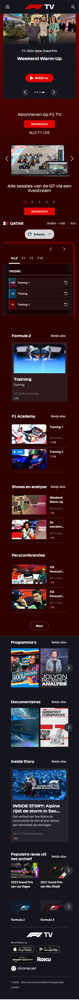

# Procesverslag
Markdown is een simpele manier om HTML te schrijven.  
Markdown cheat cheet: [Hulp bij het schrijven van Markdown](https://github.com/adam-p/markdown-here/wiki/Markdown-Cheatsheet).

Nb. De standaardstructuur en de spartaanse opmaak van de README.md zijn helemaal prima. Het gaat om de inhoud van je procesverslag. Besteedt de tijd voor pracht en praal aan je website.

Nb. Door *open* toe te voegen aan een *details* element kun je deze standaard open zetten. Fijn om dat steeds voor de relevante stuk(ken) te doen.

## Jij

  
uitwerken voor kick-off werkgroep

  ### Auteur:
  Berend Janssen

  #### Je startniveau:
  Rood

  #### Je focus:
  Responsive (Focus plane als genoeg tijd)
 

## Je website

  
uitwerken voor kick-off werkgroep

  ### Je opdracht:
  https://f1tv.formula1.com/ - F1TV

  #### Screenshot(s) van de eerste pagina (small screen): 
  hier de naam van de pagina  
  

  #### Screenshot(s) van de tweede pagina (small screen):
  hier de naam van de pagina  
  

  #### Screenshot(s) van het hamburgermenu (small screen):
  hier de naam van de pagina  
  
 

## Toegankelijkheidstest 1/2 (week 1)

  
uitwerken na test in 2e werkgroep

  ### Bevindingen eigen tests
  - Optie voor grotere tekst is erg fijn voor mensen die slechtziend zijn, afhankelijk van hoe slechtziend iemand is zien zij toch wel echt heel weinig
  - Wanneer ik een speciefieke website op wil zoeken, en die vervolgens goed wil navigeren, terwijl ik een ballon probeer hoog te houden blijkt dit best lastig. 
  - Met vingers aan elkaar gebonden merkte ik weinig problemen vergeleken met normaal. Ik zou ook niet weten hoe je dit soort gebruikers kunt helpen vanuit je website.
  - Voor mensen met parkinsons of spasme kan ik begrijpen dat het gebruiken van een toetsenbord erg hinderlijk kan zijn. Voor hun is het erg handig als zij websites kunnen navigeren met maar een knop.

  ### Bevindingen F1TV Website met narrator
  HOMEPAGINA
  - Wanneer je op de landingspagina aankomt is het eerste wat voorgelezen wordt de naam van je account. Deze staat rechtsboven. Dit vind ik een beetje verwarrend, zelf zou ik gewoon linksboven beginnen denk ik.
  - Vervolgens kan je makkelijk door het primaire menu tabben, wel weer van recht naar links ipv links naar rechts.
  - Na het primaire menu kom je in het secundaire menu. Hier tab je wel doorheen van links naar rechts. 
  - Door de content heen tabben werkt allemaal best goed. Het enige wat ik opmerkelijk vond is dat de knoppen waarmee je door een slideshow scrollt allemaal 'button' heetten en niet bijvoorbeeld 'button slide naar links' of   
    'button slide naar rechts'
  - Bij de carrousellen van de 'Laatste race', 'verder kijken' en 'Populaire races uit het archief' moet je door alle opties heen tabben voordat je naar de volgende rij op de homepagina kan. Bij alle andere carousellen is dit 
    niet het geval.
  - De knoppen om naar de app of play store te gaan worden gewoon voorgelezen als 'i-m-g'.

  DETAILPAGINA
  - 

## Breakdownschets (week 1)

  
uitwerken na afloop 3e werkgroep

  ### Homepagina: 
  

  ### Detailpagina: 
  

  ### Hamburger-menu: 
  

## Voortgang 1 (week 2)

  
uitwerken voor 1e voortgang

  ### Stand van zaken
  hier dit ging goed & dit was lastig (neem ook screenshots op van delen van je website en code)

  HTML bestandje opbouwen ging makkelijk, hier en daaralleen niet de beste tags gekozen. Had in eerste instantie wat problemen met het goed sticky krijgen van de header maar dat duurde niet al te lang.

  ### Agenda voor meeting
  samen met je groepje opstellen

  | student 1      | student 2          | student 3    | student 4        |
  | ---            | ---                | ---          | ---              |
  | nvt            | nvt                | nvt          | nvt              |
  |                |                    |              |                  |
  | ...            | ...                | ...          | ...              |
  

  ### Verslag van meeting
  hier na afloop snel de uitkomsten van de meeting vastleggen

  - F!TV website veranderd afhankelijk voor van of er een race-weekend aan de gang is
  - Buttons linken naar punt in dezelfde pagina, A's (anchors) naar andere pagina's
  - Sections & articles moeten een H element bevatten, anders div
  - Kleine 'F1 logo tags' kunnen gedaan worden met border-left
  - Hele eerste carousel in header
  - H1 is abonneren op F1TV

## Voortgang 2 (week 3)

  
uitwerken voor 2e voortgang

  ### Stand van zaken
  hier dit ging goed & dit was lastig (neem ook screenshots op van delen van je website en code)

  - Hamburgermenu gelukt, alleen niet goed sticky
  - Lastig om te weten in wat voor situaties flexbox of grid handiger is
  - Wat zijn precies de regeltjes rondom classes en id's
  - Dingen wel in hamburger op ene pagina maar niet op andere
  - Beste manier om een carousel te maken

  ### Agenda voor meeting
  samen met je groepje opstellen

  | student 1      | student 2          | student 3    | student 4        |
  | ---            | ---                | ---          | ---              |
  | Hamburgermenu  | nvt                | nvt          | nvt              |
  | Classes & id's |                    |              |                  |
  | Carousellen    |                    |              |                  |
  | ...            | ...                | ...          | ...              |

  ### Verslag van meeting
  hier na afloop snel de uitkomsten van de meeting vastleggen

  - Open Sans proberen zonder link in html
  - Lokale font doen via CSS
  - Voor carousellen, articles met id uitwisselen via anchors met hrefjes
  - Zorgen dat iedere section en article een H heeft
  - Hamburgermenu div position fixen, juiste hoogte geven en dan overflow: scroll

## Toegankelijkheidstest 2/2 (week 4)

  
uitwerken na test in 9e werkgroep

  ### Bevindingen
  Lijst met je bevindingen die in de test naar voren kwamen (geef ook aan wat er verbeterd is):

## Voortgang 3 (week 4)

  
uitwerken voor 3e voortgang

  ### Stand van zaken
  hier dit ging goed & dit was lastig (neem ook screenshots op van delen van je website en code)

  - svg's voor standaard modus stylen in html, of ook in css?
  - Animatie hamburger manu sluiten
  - 

  ### Agenda voor meeting
  samen met je groepje opstellen

  | student 1      | student 2          | student 3    | student 4        |
  | ---            | ---                | ---          | ---              |
  | dit bespreken  | en dit             | en ik dit    | en dan ik dat    |
  | en dat ook nog | dit als er tijd is | nog een punt | dit wil ik zeker |
  | ...            | ...                | ...          | ...              |

  ### Verslag van meeting
  hier na afloop snel de uitkomsten van de meeting vastleggen

  - punt 1
  - punt 2
  - nog een punt
  - ...

## Eindgesprek (week 5)

  
uitwerken voor eindgesprek

  ### Je uitkomst - karakteristiek screenshots:
  

  ### Dit ging goed/Heb ik geleerd: 
  Korte omschrijving met plaatjes

  

  ### Dit was lastig/Is niet gelukt:
  Korte omschrijving met plaatjes

  

## Bronnenlijst

  
continu bijhouden terwijl je werkt

  Nb. Wees specifiek ('css-tricks' als bron is bijv. niet specifiek genoeg). 
  Nb. ChatGpT en andere AI horen er ook bij.
  Nb. Vermeld de bronnen ook in je code.

  1. bron 1
  2. bron 2
  3. ...

